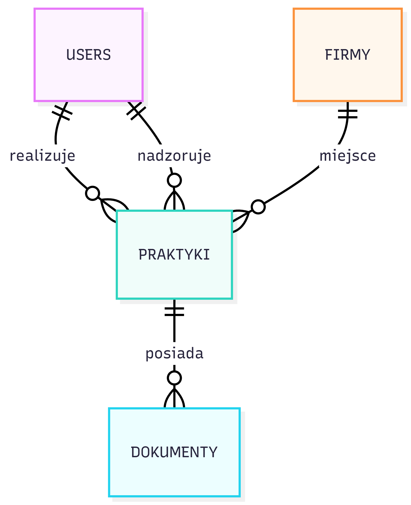
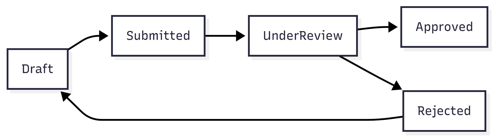

# System Obsługi Praktyk (ANS w Elblągu)

System informatyczny wspomagający proces dokumentowania i weryfikacji praktyk zawodowych dla studentów kierunku **Informatyka Stosowana** w Instytucie Informatyki Stosowanej im. Krzysztofa Brzeskiego.

## 👥 Aktorzy systemu
* **Student** – realizuje praktykę (120 dni roboczych), wypełnia dokumentację.
* **Opiekun uczelniany** – weryfikuje program i wystawia ostateczną ocenę.
* **Opiekun zakładowy** – potwierdza realizację zadań w zakładzie pracy.
* **Dziekanat** – zarządza bazą i archiwizuje dokumentację.

## 🔄 Diagramy Systemowe

### Schemat Relacji (ERD)
Poniższy diagram przedstawia architekturę bazy danych. Powiązania między studentem, opiekunem i zakładem pracy realizowane są za pośrednictwem centralnej encji **PRAKTYKI**.




### Workflow Dokumentów
Proces obiegu dokumentacji w systemie (od szkicu do zatwierdzenia):




## 🚀 Uruchomienie projektu
1. **Instalacja zależności:**

   ```bash
   pip install -r requirements.txt

2. **Inicjalizacja środowiska:**

   ```bash
   python get_fonts.py
```bash
    python seed.py

3. **Uruchomienie środowiska:**

### Technologie
Backend: Python (Flask)

Baza danych: SQLite

Frontend: Bootstrap, JavaScript

Dokumentacja: Markdown, Mermaid.js