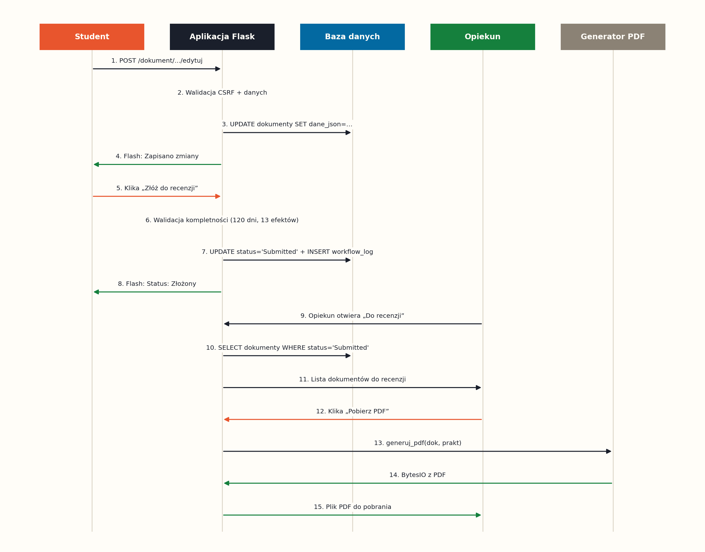
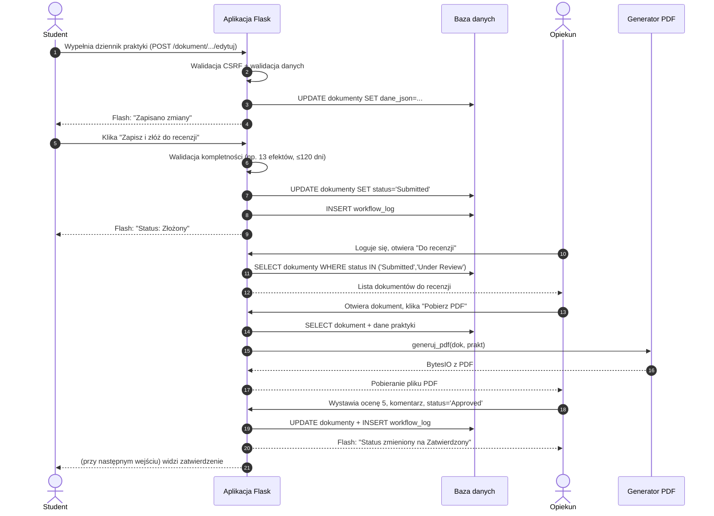
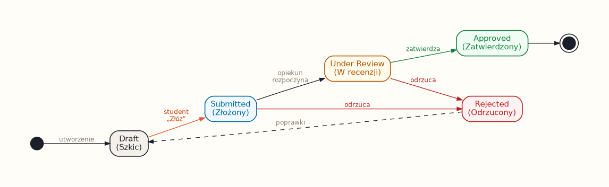
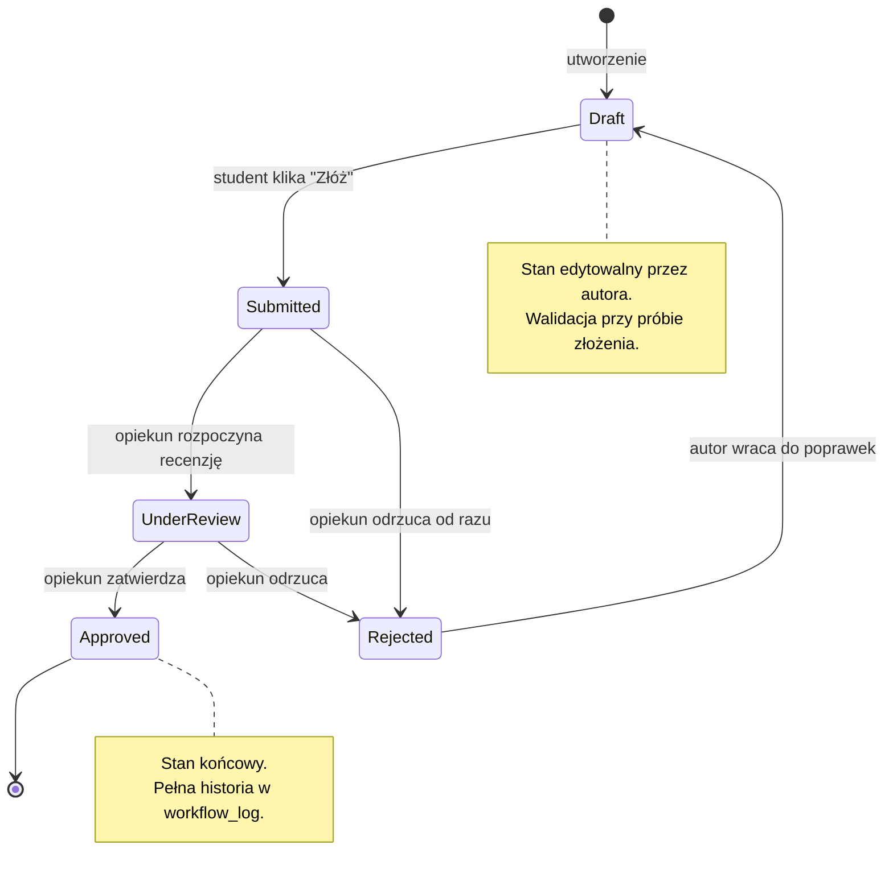
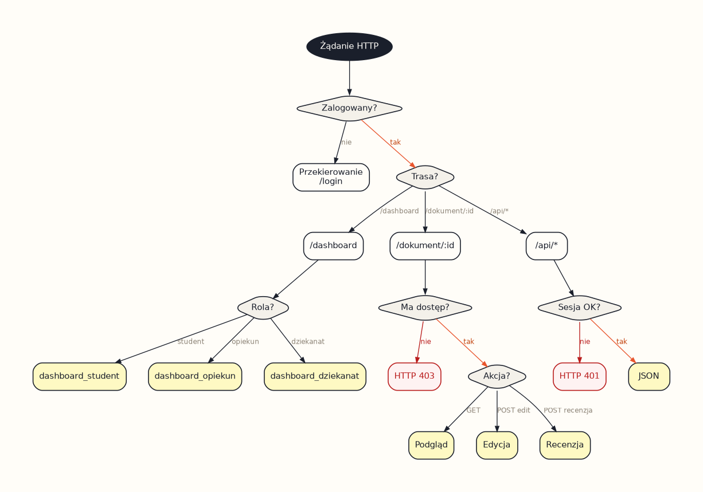
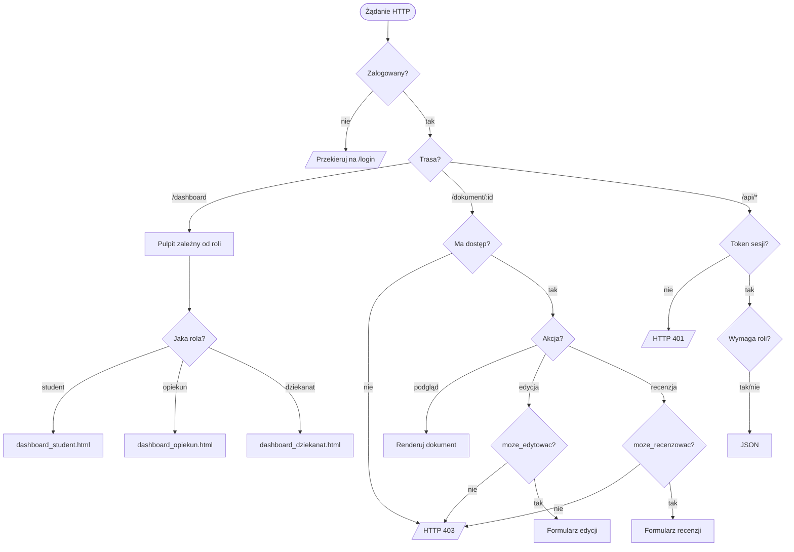
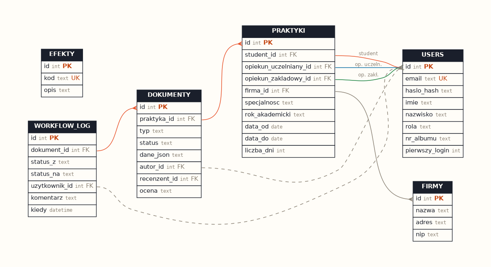
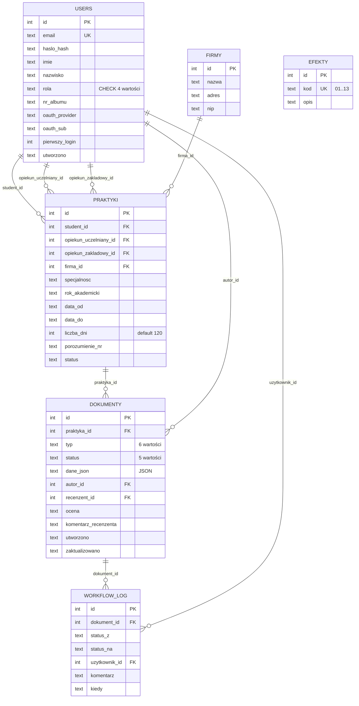

# Diagramy systemu — System Obsługi Praktyk

> Etap 5 wymagań projektu: diagram sekwencji, diagram stanów, flowchart, ERD.
> Wszystkie diagramy mają trzy reprezentacje:
> 1. **Kod źródłowy w Mermaid** poniżej — GitHub renderuje automatycznie,
> 2. **Wyeksportowane obrazki PNG** w `docs/diagrams/*.png`,
> 3. **Pliki źródłowe** `.mmd` w `docs/diagrams/` (do wklejenia na <https://mermaid.live>).
>
> Skrypt `docs/diagrams/render.py` regeneruje obrazki PNG za pomocą `graphviz`
> i `matplotlib` (uruchom: `python docs/diagrams/render.py`).

## 1. Diagram sekwencji — proces weryfikacji dokumentu



### Kod źródłowy (Mermaid)



## 2. Diagram stanów — workflow dokumentu



### Kod źródłowy (Mermaid)



## 3. Flowchart — logika uprawnień



### Kod źródłowy (Mermaid)



## 4. Diagram ERD — model danych



### Kod źródłowy (Mermaid)



## Eksport diagramów

Diagramy zostały już wyrenderowane do plików PNG w folderze `docs/diagrams/`.
Aby je zregenerować po edycji:

```bash
cd docs/diagrams
python render.py
```

Skrypt używa bibliotek `graphviz` (już zainstalowanej z `requirements.txt`
przez zależność reportlab — `pip install graphviz` jeśli trzeba osobno)
i `matplotlib`.

Diagramy można też wyeksportować z kodu Mermaid za pomocą:
- **Mermaid Live Editor** — https://mermaid.live (wklej zawartość pliku `.mmd` → Export PNG/SVG),
- **VS Code** — rozszerzenie *Markdown Preview Mermaid Support*,
- **CLI** — `mmdc -i diagram.mmd -o diagram.png` (wymaga Chromium).
